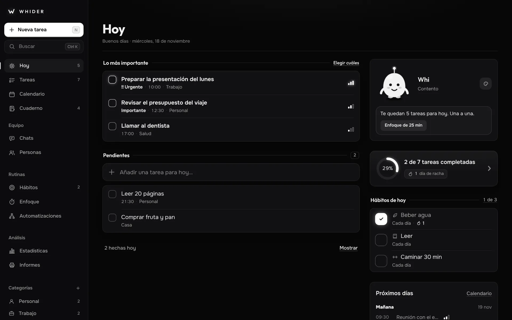
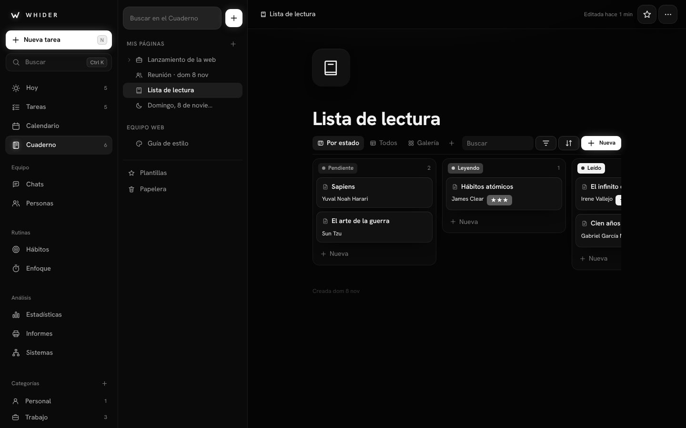
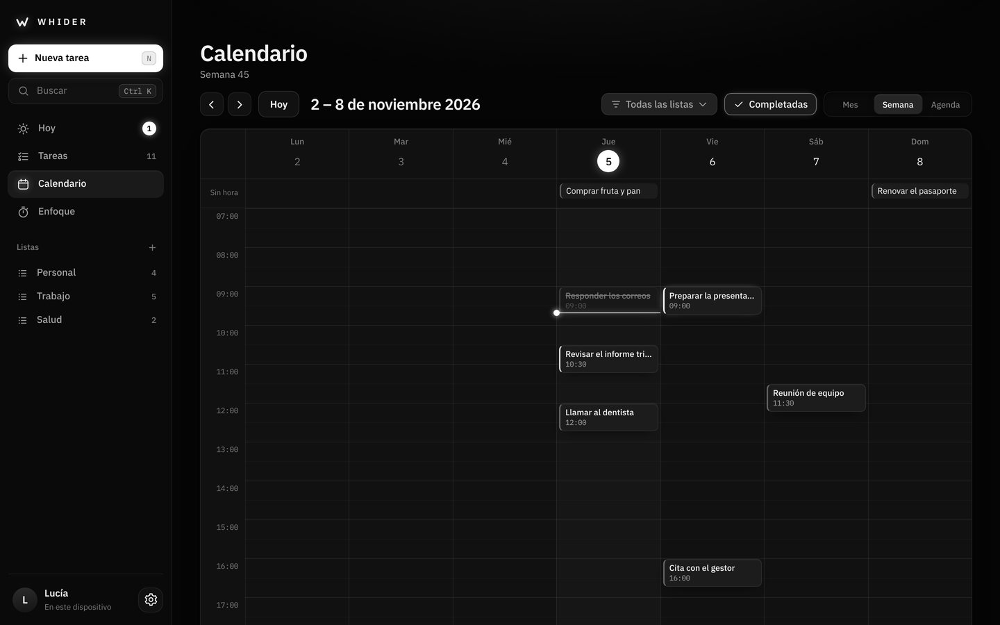

# WHIDER

**Tu día, bajo control.** WHIDER es una app de productividad **gratuita para ordenador (Windows, macOS y Linux), la web y Android** (pronto en Google Play) que se queda con lo importante: **tus tareas, ordenadas por importancia**, las **tareas de cada día**, el **calendario** y el **Cuaderno** (páginas por bloques con **fotos y archivos adjuntos**, bases de datos y plantillas). Nada más abrirla ves lo que tienes que hacer hoy, de lo más urgente a lo menos, y un campo para añadir lo que falte. Para trabajar con otros tienes **Personas, equipos y chats**: a amigos y compañeros se les añade con un **enlace o un código QR**. Incluye **cuentas** (correo o Google) con **copia en la nube**, así que tienes lo mismo en el ordenador y en el móvil, y funciona sin conexión. Con **tema oscuro o claro** (o el del sistema), importa tus tareas de **Todoist, Google Tasks, Notion o un CSV**, y en el ordenador **se actualiza sola**.

**Todo es gratis y para todos**: no hay planes de pago, anuncios ni compras dentro de la app.

**Web: [whider-red.vercel.app](https://whider-red.vercel.app)** — la portada presenta WHIDER, sus novedades y preguntas frecuentes, y ofrece la descarga para tu dispositivo (en el ordenador, Windows, macOS o Linux; en el iPhone, cómo añadirla desde Safari; en Android, Google Play, próximamente). También [en inglés](https://whider-red.vercel.app/en/). La app está en español y en inglés (Ajustes → Idioma); en el ordenador y en Android, el inglés llega con su próxima versión. La app en el navegador está en [`/app`](https://whider-red.vercel.app/app).

**Diseño sencillo, inspirado en X y en Apple**: fondo negro (o blanco), texto casi blanco, **líneas finas** en lugar de tarjetas con sombra, títulos grandes y un solo azul para lo que se puede tocar. El único color «de verdad» es el de la **importancia** de cada tarea: **urgente en rojo, importante en naranja, destacada en amarillo** y normal en gris. Una sola tipografía, **Inter**, en todo; iconos de trazo redondeado, como los de Apple, que se rellenan en la pestaña activa. En el móvil, cinco pestañas abajo y un **«+» flotante**; en el ordenador, una barra lateral con secciones grandes y **«Nueva tarea»** en cápsula, como en X.

<p align="center">
  
</p>

---

## 🧩 Estructura de WHIDER

| Apartado | Objetivo |
| --- | --- |
| **Hoy** | Lo que tienes que hacer hoy, por importancia, y lo que repites cada día. Lo primero que ves al abrir. |
| **Tareas, Calendario y Cuaderno** | Organizar: categorías y filtros, el calendario (también tus calendarios de Google, Outlook o Apple) y tus notas. |
| **Personas** | Chats, contactos y equipos, solo si trabajas con otros (si no, se quita de la barra). |

### Todo incluido, gratis

| | Qué incluye |
| --- | --- |
| **Tareas** | **Importancia** en cuatro niveles y en color · **tareas de cada día** (cada día, días laborables o los días que elijas) · categorías con icono y color · **filtros** sin límite y vista de **tablero** · selección múltiple · subtareas, notas, avisos y repeticiones · escribir en lenguaje natural («Gimnasio cada lunes y jueves a las 7 !!») |
| **Calendario** | Mes, semana y **día** por horas (arrastrar y estirar), agenda, exportar a `.ics`, el panel **«Por planificar»** (ordenador) y tus **calendarios de Google, Outlook o Apple** dentro, por su enlace |
| **Cuaderno** | Páginas por bloques, fotos y archivos adjuntos, bases de datos (tabla, tablero, lista, calendario y galería) y plantillas |
| **Personas** | Invitar por enlace, QR o código, **chats** y **equipos** con su chat, sus tareas y sus páginas compartidas |
| **General** | Tema oscuro o claro, español o inglés, avisos y sonidos, copia en la nube con cuenta, una presentación que **adapta la app a ti** y funciona sin conexión |

<p align="center">
  
  
</p>

---

## 💻 WHIDER para ordenador

| Sistema | Descarga | Instalación |
| --- | --- | --- |
| **Windows 10 y 11** | [WHIDER-Setup.exe](https://github.com/McTn4/whider-2.0-PREMIUM/releases/latest/download/WHIDER-Setup.exe) | Ábrelo y se instala solo (crea un acceso directo). Si aparece «Windows protegió su PC»: **Más información → Ejecutar de todas formas** (la app no está firmada con un certificado de pago). Se actualiza sola. |
| **macOS con Apple Silicon** (M1 o posterior) | [WHIDER-mac-arm64.dmg](https://github.com/McTn4/whider-2.0-PREMIUM/releases/latest/download/WHIDER-mac-arm64.dmg) | Arrastra WHIDER a Aplicaciones. La primera vez, ábrela con **clic derecho → Abrir**. Avisa de cada versión nueva. |
| **macOS con Intel** | [WHIDER-mac-x64.dmg](https://github.com/McTn4/whider-2.0-PREMIUM/releases/latest/download/WHIDER-mac-x64.dmg) | Igual que la anterior. |
| **Linux** (cualquiera) | [WHIDER-linux.AppImage](https://github.com/McTn4/whider-2.0-PREMIUM/releases/latest/download/WHIDER-linux.AppImage) | Dale permiso de ejecución y ábrela. Se actualiza sola. En Ubuntu 22.04 o posterior necesita `libfuse2` (`sudo apt install libfuse2`). |
| **Debian, Ubuntu y Mint** | [WHIDER-linux.deb](https://github.com/McTn4/whider-2.0-PREMIUM/releases/latest/download/WHIDER-linux.deb) | `sudo apt install ./WHIDER-linux.deb` o el instalador de programas. No necesita `libfuse2`; avisa de cada versión nueva. |

La portada los ofrece en [whider-red.vercel.app/descargar](https://whider-red.vercel.app/descargar), destacando el de tu sistema, y cada versión publicada los trae todos en la pestaña **[Releases](https://github.com/McTn4/whider-2.0-PREMIUM/releases)**, con sus novedades. **Desde la 1.1 la app se actualiza sola** en Windows y en Linux (AppImage) y avisa de cada versión nueva en macOS y en Linux (.deb, nuevo en la 1.1, que no necesita `libfuse2`). La app también funciona en el navegador del ordenador con el mismo diseño, en [`/app`](https://whider-red.vercel.app/app).

**Pensada para pantalla grande, ratón y teclado**
- **Barra lateral como la de X**: el logotipo, *Buscar*, **Hoy, Tareas, Calendario, Cuaderno y Personas** (en grande, con el icono relleno en la que estás) y **«Nueva tarea»** en cápsula; debajo, tus **categorías** y **filtros**, y abajo tu cuenta y los ajustes. Los contadores y el tamaño se eligen en *Ajustes → Lo que ves*.
- **Hoy a dos columnas**: a la izquierda, el campo para añadir, **«Cada día»** y **«Por hacer»** por importancia; a la derecha, **los próximos 7 días**, la agenda de tus calendarios, **quién te está esperando** (mensajes y solicitudes) y tus páginas recientes.
- **Varias tareas a la vez**: `Ctrl`/`⌘` clic, `Mayús` clic o `Ctrl A` y una barra para cambiar fecha, hora, prioridad, categoría, repetición y avisos, duplicar, completar o eliminar (con Deshacer). Arrastra cualquiera de ellas y se mueven todas.
- **Cuaderno** con el árbol de páginas a la izquierda y la página a lo ancho; **chats** con la lista y la conversación a la vez.
- **Calendario grande**: el **mes** con las tareas dentro de cada día y el día elegido al lado, y la **semana en 7 columnas por horas** con la hora actual. Haz clic en un hueco para crear una tarea a esa hora y **arrastra** cualquier tarea a otro día u otra hora.
- **Editor en un panel a la derecha**, sin perder de vista la lista; diálogos centrados y la creación rápida arriba, como una barra de comandos.
- **Campo para añadir** en Hoy y en cada lista: escribe y pulsa Intro (entiende fecha, hora, `#lista`, `!` de importancia y «cada día»).
- **Clic derecho** en una tarea: completar, editar, pasarla a hoy, a mañana o al lunes, cambiar la importancia o la lista, marcarla «En curso» o eliminarla.
- **Arrastra** una tarea a una lista de la barra lateral para moverla, a «Hoy» para hacerla hoy o a un día del calendario.
- **Buscar** (`Ctrl K` / `⌘ K`): encuentra tareas y listas, ve a cualquier sección o crea la tarea con lo que has escrito.

**Atajos de teclado** (pulsa `?` para verlos en la app)

| Atajo | Acción |
| --- | --- |
| `N` · `Alt N` | Nueva tarea · nueva página del Cuaderno |
| `Ctrl K` · `/` | Buscar tareas, páginas, personas y acciones |
| `1` … `5` | Hoy · Tareas · Calendario · Cuaderno · Personas |
| `/` en una página | Menú de bloques del Cuaderno (títulos, listas, casillas, tablas, bases de datos…) |
| `Ctrl ,` | Ajustes |
| `↑` `↓` · `Espacio` · `Intro` · `Supr` | Moverse por la lista · completar · editar · eliminar |
| `←` `→` · `T` · `M` `S` `D` `A` | En el calendario: anterior y siguiente · hoy · mes, semana, día y agenda |
| `Ctrl` clic · `Mayús` clic · `Ctrl A` | Seleccionar varias tareas · un tramo · todas (`Espacio` las completa, `Supr` las elimina) |
| `Ctrl Intro` · `Esc` | Guardar · cerrar |

**La app de escritorio**
- Ventana con la franja de título integrada en el diseño (Windows y macOS); recuerda su tamaño y posición.
- **Sigue en la bandeja del sistema** al cerrar la ventana para avisarte de tus tareas, y puede **abrirse al iniciar el ordenador** (Ajustes → Ordenador). Desde la bandeja: abrir, nueva tarea, buscar, las tareas de hoy, una página nueva y salir.
- Notificaciones del sistema y aviso en el icono de la barra de tareas cuando hay tareas vencidas.
- **Entrar con Google**: se abre tu navegador, eliges la cuenta y vuelves a la app (Google no permite iniciar sesión dentro de otras apps). Con correo y contraseña se entra directamente.
- Funciona sin conexión: la app web va dentro y tus datos se guardan en el ordenador (y en tu cuenta, si has iniciado sesión).

<p align="center">
  
  
</p>
<p align="center">
  
  
</p>

---

## 🧭 Organización

En el ordenador, las secciones están en la barra lateral, de lo más importante a lo menos. En el móvil, una barra abajo con **cinco pestañas** (Personas solo si trabajas con otros; se elige en la presentación y en *Ajustes → Lo que ves*) y el botón **+** flotante, abajo a la derecha:

| Pestaña | Qué encontrarás |
| --- | --- |
| **Hoy** | Arriba, un **campo para escribir** la tarea, con su **importancia** y **«Cada día»**. Debajo, **«Cada día»** (lo que repites a diario, tachado en su sitio cuando lo haces) y **«Por hacer»**: lo de hoy y lo vencido, **de lo más importante a lo menos** (lo que ya empezaste, delante; lo vencido, con su fecha en rojo). Lo hecho, plegado al final, y la agenda de tus calendarios. Los primeros días, **Primeros pasos** enseña lo esencial con tus propias tareas. |
| **Tareas** | Buscador, **listas inteligentes** (Hoy · Programadas · Todas · Prioritarias) y **Mis categorías** (Personal, Trabajo…), cada una con su página, y tus **filtros**. |
| **Calendario** | Vistas de **Mes**, **Semana por horas** y **Agenda**, con filtro por categoría, tus tareas que se repiten y los eventos de tus calendarios. |
| **Cuaderno** | Tus páginas: favoritas, recientes y todas, con búsqueda, plantillas y papelera. |
| **Personas** | Tu tarjeta para invitar (enlace, QR o código), las solicitudes, **tus chats recientes**, tus **contactos** y tus **equipos**. |
| **+** | **Creación rápida** desde cualquier pantalla: escribe «Llamar a Ana mañana a las 10 #trabajo !!» y WHIDER pone la fecha, la hora, la categoría y la importancia. |

Arriba a la izquierda, **tu foto** (o tu inicial) abre los **Ajustes**, con tu cuenta lo primero, como en X.

---

## ✨ Funciones

**Calendarios suscritos**
- **Ajustes → Calendarios suscritos** (o «Calendarios» en el calendario): pega el enlace iCal (`.ics` o `webcal://`) de tu calendario de **Google**, **Outlook** o **Apple**, o el de los festivos, y sus eventos se ven en el calendario (mes, semana, día y agenda, con su hora y su duración) y en **Hoy**, en «Agenda de hoy». Hasta 10 calendarios, cada uno se puede ocultar o quitar.
- Se actualizan solos cada hora y siguen ahí sin conexión. Se ven, no se cambian (para eso, su propia app); desde la ficha de un evento, **Crear una tarea** lo convierte en una tarea con su día, hora y notas.
- Repeticiones, excepciones y zonas horarias como en el calendario original (también los cambios de hora). La lista va con tus ajustes, así que con cuenta la tienes en todos tus dispositivos.

**Cuaderno (antes «Apuntes»)**
- **Páginas por bloques**: texto, tres tamaños de título, listas, casillas, desplegables, citas, avisos destacados, código, separadores, tablas, imágenes, enlaces web, subpáginas, índice, **bases de datos**, **tareas de WHIDER** con su aviso y la **agenda de hoy**. Escribe `/` para el menú de bloques (o `#`, `-`, `[]`… al empezar la línea), arrastra cualquier bloque para moverlo y selecciona texto para darle formato.
- **Fotos y archivos adjuntos** (PDF, documentos, hojas de cálculo… hasta 15 MB cada uno): con *Adjuntar*, el menú `/`, pegando o arrastrándolos. Las fotos se ven en la página y en un visor a pantalla completa; los archivos, con su nombre, tipo y tamaño, se abren, se descargan o se quitan (con *Deshacer*). Se guardan en el dispositivo y en tu cuenta, así que siguen ahí al recargar y en tus otros dispositivos.
- **Páginas dentro de páginas**, con icono, portada, favoritas, papelera y búsqueda en todo el Cuaderno (también por el nombre de los archivos).
- **Bases de datos** con propiedades (texto, número, selección, varias opciones, estado, fecha, casilla, enlace, persona, creada y editada) y vistas de **tabla**, **tablero**, **lista**, **calendario** y **galería**, con filtros, orden y búsqueda. Cada fila es también una página.
- **Plantillas**: reunión, proyecto, diario, apuntes de clase, plan semanal, lista de lectura, hoja de ruta, wiki del equipo y contactos y clientes.
- **Páginas de equipo**: compártelas con un equipo y editadlas a la vez (los cambios se juntan bloque a bloque).
- Se guarda al momento, funciona sin conexión y se sincroniza con tu cuenta. Los apuntes de versiones anteriores se convierten solos en páginas.

**Hoy, por importancia, y tareas de cada día**
- **Importancia** en cuatro niveles: **urgente** (rojo), **importante** (naranja), **destacada** (amarillo) y normal. Se ve en el círculo de cada tarea, se escribe al lado («Urgente», «Importante») y ordena Hoy. Se elige al escribir la tarea (con el botón *Importancia* o con `!`, `!!` y `!!!`) o tocándola.
- **Tareas de cada día**: una tarea puede repetirse **cada día**, los **días laborables** o los **días de la semana que elijas** («Gimnasio cada lunes, miércoles y viernes a las 7»). Salen en «Cada día» y, si un día se quedan sin hacer, **pasan solas al siguiente día que les toca**: no se acumulan como vencidas.
- **Tus hábitos de antes** son ahora tareas de cada día, con su horario (que pasa a ser su aviso) y su objetivo en el título; su historial sigue guardado en tu cuenta.
- **Una presentación que adapta la app**: para qué la vas a usar (estudios, trabajo, casa, salud, con otras personas) prepara tus categorías, los ejemplos que te propone y si la pestaña Personas está en la barra. Se repite en *Ajustes → Ayuda → Adaptar WHIDER a ti*.

**Personas, equipos y chats**
- **Contactos** (de amigos o de trabajo), en una sola lista. Se añaden con tu **enlace de invitación**, tu **código QR** (se escanea con la cámara del móvil o del ordenador) o tu código `WH-…`. El enlace funciona aunque la otra persona aún no tenga la app: la página de invitación la abre o le dice dónde descargarla.
- **Equipos** con sus miembros, su enlace para entrar, su **chat** y sus **páginas del Cuaderno**.
- **Chats** con cada contacto y con cada equipo: responder, reaccionar, editar y borrar tus mensajes, y compartir **tareas**, **páginas** y ánimos (quien los recibe los añade a lo suyo con un toque). Avisos de mensajes nuevos con la app abierta y contadores en la barra lateral y en la pestaña Personas.
- Tus contactos solo ven tu **nombre y tu foto** (o tu inicial); nunca tus tareas ni tu Cuaderno, salvo lo que compartas.

**Cuentas y copia en la nube**
- Registro con **correo y contraseña** (con verificación del correo, medidor de seguridad de la contraseña y recuperación por correo) o con **Google** (en Android, con el selector nativo de cuentas del teléfono).
- Opción para admitir **solo correos de empresa** (`allowedEmailDomains`).
- Tus tareas, categorías, tu Cuaderno y tus ajustes se guardan en tu cuenta y se **sincronizan al momento** entre dispositivos; los cambios de varios dispositivos se fusionan sin perder nada.
- Funciona sin internet y sincroniza al volver la conexión. Cerrar sesión y **eliminar la cuenta** desde Ajustes → Cuenta.
- Modo **sin cuenta** opcional: los datos se quedan en el dispositivo y se suben a la cuenta si la creas más tarde.
- Configuración: [docs/CONFIGURAR-CUENTAS.md](docs/CONFIGURAR-CUENTAS.md).

**Tareas y listas**
- **Creación rápida en lenguaje natural**: «mañana», «el lunes», «el 15», «20/11», «en 3 días», «a las 5 de la tarde», «cada día», «cada lunes y jueves», «#lista» y «!»/«!!»/«!!!» para la importancia. Lo detectado aparece en etiquetas que puedes descartar; con Intro se añade y queda listo para la siguiente.
- **En curso**: marca una tarea como empezada (clic derecho o el editor) y sale la primera en Hoy, con medio círculo relleno.
- **Color de categoría** opcional (verde, azul, turquesa, violeta o rosa): un punto junto a su nombre en las tareas, el calendario y la barra lateral.
- **Listas** propias, más cuatro **listas automáticas** que se rellenan solas (Hoy, Programadas, Todas y Prioritarias).
- **Importar desde otras apps** (*Ajustes → Datos* o la paleta de comandos): **Todoist** (CSV de cada proyecto), **Google Tasks** (Google Takeout), **Notion** (CSV de una base de datos), **calendarios** `.ics` de Google, Outlook o Apple (con su hora y zona horaria, duración y repetición) y cualquier **hoja de cálculo** CSV eligiendo qué columna es cada cosa. Antes de importar se ve una vista previa con las categorías nuevas, las tareas que ya tienes (no se duplican) y lo que no se entendió; durante un día se puede **deshacer**.
- **Compartir con WHIDER**: desde otra app (Android) o desde el menú *Compartir* del sistema (web instalada), un texto o un enlace se convierte en una tarea nueva.
- Fecha con **calendario integrado**, hora, **subtareas**, **notas** y **repeticiones** (cada día, días laborables, cada semana —en uno o varios días— y cada mes).
- **Gestos**: desliza → para completar y ← para eliminar, con **Deshacer**.
- Búsqueda en títulos, notas y subtareas; orden por fecha, prioridad, recientes o título.
- Si cierras el editor con cambios sin guardar, WHIDER te pregunta antes de descartarlos.

**Avisos**
- **Recordatorio previo** configurable (de 5 minutos a 1 día antes) y **aviso si no la haces** al vencer el plazo, repetible cada 10, 20 o 60 minutos.
- **Horas de silencio**: sin sonidos ni notificaciones en tu horario de descanso.
- En la app Android, los recordatorios **suenan aunque la app esté cerrada** y se restauran al reiniciar el móvil.

**Calendario**
- **Mes**: un punto por tarea pendiente (hasta tres), uno rojo si hay algo vencido y uno hueco para las repeticiones futuras; menú para saltar de mes y el día elegido con sus tareas por hora y un campo para **añadir directamente a ese día**.
- **Semana**: tira de 7 días con su progreso y el **día por horas** con la hora actual; **toca un hueco** para crear una tarea a esa hora y **mantén pulsada una tarea para arrastrarla** a otra hora.
- **Agenda**: lo vencido y los próximos 30 días, día a día.
- Las tareas que se repiten se ven también en los días futuros, filtro por lista y opción de ocultar las completadas.

**Tus datos no se pierden**
- Todo se guarda al instante en el dispositivo; en el APK además en un almacén nativo de Android, que los recupera aunque el sistema limpie el almacenamiento de la app.
- Con cuenta, también en la nube: al iniciar sesión en otro móvil lo recuperas todo.

**Ajustes**
- Tamaño de texto (4 niveles), densidad cómoda o compacta y movimiento reducido.
- Pantalla al abrir, lista por defecto, aviso por defecto, primer día de la semana, formato 12/24 h y confirmación al eliminar.
- *Lo que ves*: la pestaña Personas y, en el ordenador, la barra lateral, el calendario y el orden de las categorías.

---

## 📱 Pantalla y Android

- **Widget «Hoy»** para la pantalla de inicio: las tareas de hoy (lo urgente primero), cuántas llevas y un botón para añadir.
- **Avisos a la hora exacta** (Android 12+), si lo permites en *Ajustes → Avisos*; sin el permiso, los recordatorios llegan igualmente, con unos minutos de margen.

> **Descarga el APK de pruebas**: [WHIDER-android.apk](https://github.com/McTn4/whider-2.0-PREMIUM/releases/latest/download/WHIDER-android.apk), en cada versión publicada (pestaña **[Releases](https://github.com/McTn4/whider-2.0-PREMIUM/releases)**); la app avisa cuando hay una nueva. El **paquete para Google Play (AAB)** queda en los artefactos de cada compilación (**Actions → Compilar APK**). Cómo publicarla: [`docs/PUBLICAR-EN-GOOGLE-PLAY.md`](docs/PUBLICAR-EN-GOOGLE-PLAY.md).

- Los **enlaces de invitación** (`https://whider-red.vercel.app/i/…`) abren la app directamente, y el lector de **códigos QR** usa la cámara trasera.

- Preparada para Google Play: apunta a **Android 16 (API 36)** y se dibuja **de borde a borde**, apartando el contenido de la barra de estado, la de navegación, la muesca y el teclado; detrás de las barras se ve el mismo fondo que la app.
- Se adapta a móviles pequeños (360 px), grandes, en horizontal y a tablets.
- Tamaño del texto: la primera vez sigue el tamaño de letra del sistema (normal, grande o enorme) y después se elige en **Ajustes → Apariencia**, sin descuadrar el diseño.
- Teclado: los formularios se redimensionan para no quedar tapados.
- Icono adaptable (Android 8+) con la W en blanco sobre negro, icono temático (Android 13+) e icono propio en la barra de notificaciones.
- Botón **Atrás** (también con el gesto predictivo de Android 16): cierra menús y hojas, vuelve a la página anterior (de una lista a Tareas, del Perfil a la pestaña en la que estabas o dentro de Ajustes), después a la pestaña inicial y solo entonces sale.

---

## ▶️ Probar en el navegador

Con Python 3.8 o superior:

```bash
python serve.py
```

Se abre `http://localhost:8080` y la consola muestra también la dirección para el móvil en tu red Wi‑Fi. Opciones: `python serve.py 9000` (otro puerto) y `python serve.py --no-open`. En local la app está en `/` y en `/app`, y la portada en `/sitio/`.

## 🌐 La web (Vercel)

| Dirección | Qué es |
| --- | --- |
| `/` | **Portada** ([`sitio/index.html`](sitio/index.html)): qué es WHIDER, «Abrir en el navegador» y la descarga según el dispositivo. En el ordenador destaca su sistema (Windows, macOS o Linux) con el tamaño de cada instalador; en el móvil muestra **Google Play · Próximamente** y cómo añadir la web a la pantalla de inicio. Quien ya usa WHIDER en ese navegador entra directo a la app (`/?inicio` enseña la portada igualmente). |
| `/app` | La app en el navegador (la misma `index.html` que usan Android y el ordenador). |
| `/descargar` | Lleva a la sección de descarga de la portada (también desde **Ajustes → Descargar la app** en la web). |
| `/i/…` | Invitaciones: abren la app o la web y ofrecen las mismas descargas. |
| `/privacidad/` | Política de privacidad; «Eliminar mi cuenta» abre `/app#cuenta`. |
| `/en/` y `/privacy/` | La portada y la política de privacidad en inglés ([`sitio/en/index.html`](sitio/en/index.html), [`privacy/index.html`](privacy/index.html)). |
| `/api/calendario` | La única parte con servidor: trae un calendario `.ics` para los calendarios suscritos ([`api/calendario.js`](api/calendario.js)), sin guardarlo, solo de direcciones públicas y con límites de tamaño, tiempo y uso. |

Vercel ejecuta `node tools/web-build.js` (ver [`vercel.json`](vercel.json)), que deja en `dist/` la portada como `index.html` y la app como `app.html`, servida en `/app`. Para verla igual en local: `node tools/web-build.js` y sirve `dist/` con esas mismas reglas. Las direcciones de descarga están todas en [`sitio/descargas.js`](sitio/descargas.js): cuando WHIDER esté en Google Play, basta con poner su enlace en `play`.

Si tienes [`cloudflared`](https://developers.cloudflare.com/cloudflare-one/connections/connect-networks/downloads/) instalado, el servidor crea además un enlace HTTPS temporal: ábrelo en Chrome del móvil y usa **⋮ → Instalar aplicación** para instalarla como app.

## 🛠️ Abrir y compilar la app de escritorio

Con Node.js 20 o superior:

```bash
cd desktop
npm install
npm start
```

`npm start` copia la app web a `desktop/www` y abre WHIDER. Para crear el instalador de tu sistema: `npm run dist` (queda en `desktop/dist`).

## 🛠️ Compilar el APK (Android Studio)

1. Sincroniza la web con el proyecto Android:
   ```bash
   python package_apk.py --sync
   ```
2. Abre la carpeta **`android/`** en Android Studio (JDK 17 o superior) y pulsa **Run**, o desde la terminal:
   ```bash
   cd android
   ./gradlew assembleDebug
   ```
3. El APK queda en `android/app/build/outputs/apk/debug/app-debug.apk`.

---

## 📂 Estructura

```text
.
├── index.html              # Estructura de la app + iconos de trazo redondeado (SVG propio, rellenos en la pestaña activa)
├── manifest.json           # PWA: iconos y accesos directos (nueva tarea, nueva página, tareas de hoy, chats)
├── sw.js                   # Funcionamiento sin conexión y clic en notificaciones
├── sitio/                  # La web: portada (index.html), enlaces de descarga (descargas.js) y capturas (img/)
├── i/index.html            # Página de las invitaciones (enlaces y QR): abre la app o la web, o enseña a descargarla
├── privacidad/index.html   # Política de privacidad pública (la que pide Google Play) y cómo eliminar la cuenta
├── .well-known/            # assetlinks.json: los enlaces de invitación abren la app de Android (App Links)
├── css/
│   ├── tokens.css          # Colores (y los de la importancia), Inter, radios de esquina, tamaños y movimiento
│   ├── layout.css          # Pantalla de carga, estructura, barra superior, barra inferior y el «+» flotante
│   ├── components.css      # Filas de tarea, celdas agrupadas, botones en cápsula, hojas, alertas, menús, interruptores…
│   ├── screens.css         # Estilos de cada pantalla
│   ├── social.css          # Personas, chats, fotos de perfil, invitaciones y QR
│   ├── cuaderno.css        # Cuaderno: editor por bloques y bases de datos (se carga al abrirlo)
│   └── desktop.css         # Ordenador: barra lateral (como la de X), diálogos, calendario grande, ratón y teclado
├── firestore.rules         # Reglas de seguridad: tus datos solo tuyos; perfiles, buzón, equipos y chats solo de sus miembros
├── firebase.json           # Configuración de Firebase (reglas, hosting y emuladores)
├── vercel.json             # Publicación de la web: compilación (tools/web-build.js), /app y /descargar
├── js/
│   ├── config.js           # ← Configuración de cuentas (Firebase) y enlaces: ver docs/CONFIGURAR-CUENTAS.md
│   ├── vendor/             # SDK de Firebase empaquetado (funciona sin CDN), generador y lector de códigos QR
│   ├── core/               # util, schema (datos y tareas de cada día), store, parse (lenguaje natural), audio, notify,
│   │                       #   auth (cuentas), sync (nube), files (archivos adjuntos del Cuaderno), pages y pagesync
│   │                       #   (Cuaderno), calendars e ical (calendarios suscritos), community (personas y equipos),
│   │                       #   chat (chats) e invite (enlaces y QR)
│   ├── ui/                 # avisos, menús, hojas, controles, perfil, editor, creación rápida, fila de tarea,
│   │                       #   diseño (layout), barra lateral, búsqueda, atajos, selección múltiple (select),
│   │                       #   filtros, fotos de perfil (avatar), primeros pasos y, para el Cuaderno, blocks (editor)
│   │                       #   y dbview (bases de datos)
│   ├── screens/            # home (Hoy), tasks, calendar, notes (Cuaderno), friends (Personas), chats, onboarding
│   │                       #   (presentación), settings (Ajustes)…
│   ├── router.js
│   └── app.js
├── icons/                  # Logotipo (SVG) e iconos PNG 192/512/maskable
├── fonts/                  # Inter (variable, 100–900 y tamaño óptico), local, con su licencia OFL
├── desktop/                # App de escritorio (Electron): ventana, bandeja, acceso con Google por el navegador
├── android/                # Proyecto nativo (WebView + recordatorios + notificaciones), API 36
├── tools/
│   ├── web-build.js        # Prepara la web para Vercel en dist/ (portada en /, app en /app)
│   ├── servir-web.py       # Sirve dist/ en local con las mismas reglas que vercel.json
│   ├── iconos/             # Generador de la colección de iconos y su muestrario
│   ├── capturas/           # Capturas de la portada, imagen para compartir y recorrido por las pantallas
│   └── firebase-bundle/    # Cómo regenerar js/vendor/firebase.js
├── tests/
│   ├── unit/               # Lógica sin navegador (node --test): fechas, lenguaje natural, tareas, sincronización…
│   ├── e2e/                # Recorridos reales con Playwright: app, web, cuentas (emuladores) y escritorio
│   └── run.mjs             # Lanzador de las pruebas (arranca servidores y emuladores si hace falta)
├── types/whider.d.ts       # Tipos comunes para la comprobación progresiva con TypeScript
├── package.json            # Herramientas de desarrollo y comandos (npm run check, npm test…)
├── serve.py                # Servidor local para PC y móvil
└── package_apk.py          # Copia la web a android/…/assets/www y crea el ZIP del proyecto
```

Cómo instalar, ejecutar, probar y compilar todo desde cero: [docs/DESARROLLO.md](docs/DESARROLLO.md).

## 🚀 Para quien publica la app

- **Versiones**: la versión está en `package.json` y se cambia con `node tools/version.js 1.2.0`; al subirla a `main`, GitHub publica la versión con todos los instaladores y las notas de [`CHANGELOG.md`](CHANGELOG.md). Paso a paso: [`docs/PUBLICAR-UNA-VERSION.md`](docs/PUBLICAR-UNA-VERSION.md).
- **Google Play**: la guía paso a paso (clave de subida, secretos de GitHub, Play Console, seguridad de los datos y las huellas de la firma de Google) está en [`docs/PUBLICAR-EN-GOOGLE-PLAY.md`](docs/PUBLICAR-EN-GOOGLE-PLAY.md).
- **Cuentas y nube**: [`docs/CONFIGURAR-CUENTAS.md`](docs/CONFIGURAR-CUENTAS.md). Publica las reglas de [`firestore.rules`](firestore.rules) en *Firebase → Firestore Database → Reglas* cada vez que cambien.
- **Archivos del Cuaderno**: se guardan en Firestore en trozos de menos de 1 MB, sin Cloud Storage (que exige el plan de pago de Firebase); en el plan gratuito caben 1 GB de datos en total. Si crecen mucho, pueden ir a Firebase Storage con `storage: true` en `js/config.js` (preparado y probado; pasos en [`docs/CONFIGURAR-CUENTAS.md`](docs/CONFIGURAR-CUENTAS.md)).
- **Sincronización**: los cambios se suben al momento y lo que cambia en otro dispositivo llega en un par de segundos (la app escucha la nube en lugar de consultarla cada poco; sin escuchas, la consulta cada 15 segundos); si algún día se queda corto el plan gratuito de Firebase (50 000 lecturas al día), basta con pasar al plan de pago por uso. Cifras en [docs/COSTES.md](docs/COSTES.md).

## 🔒 Privacidad

Sin cuenta, todo se queda en el dispositivo. Con cuenta, los datos se guardan además en tu proyecto de Firebase, protegidos por reglas que solo permiten a cada usuario acceder a lo suyo ([`firestore.rules`](firestore.rules)). Tus contactos solo ven tu perfil público (tu nombre y tu foto o tu inicial), nunca tus tareas ni tu Cuaderno. Los mensajes de un chat solo los leen sus miembros, y las páginas de un equipo y sus archivos adjuntos, solo los miembros del equipo. WHIDER nunca ve ni guarda contraseñas (las gestiona Firebase Authentication), no muestra publicidad y permite eliminar la cuenta y todos sus datos de la nube (también el Cuaderno con sus archivos, el perfil público y el código de contacto) desde Ajustes o, sin la app, desde la web (`https://whider-red.vercel.app/app#cuenta`). Política completa: [`privacidad/index.html`](privacidad/index.html), publicada en `https://whider-red.vercel.app/privacidad/`.

---

---

## 📝 Novedades

Todas las versiones y lo que trae cada una: [`CHANGELOG.md`](CHANGELOG.md) (también en la app: Ajustes → Ayuda → Novedades).

### 1.1

- **Importar** desde Todoist, Google Tasks, Notion, calendarios (.ics) o un CSV, con vista previa y deshacer.
- **Tema claro** (u «Como el sistema»), con contraste comprobado en todas las pantallas.
- **Hoy por estados** y tareas «En curso»; **color por categoría** y **prioridad legible** (también sin color).
- **Sincronización sin pérdidas** entre dispositivos y errores de la nube explicados.
- **Copias automáticas** sin cuenta (ordenador y Android) y **actualizaciones automáticas** en el ordenador.
- **Android**: widget «Hoy», compartir con WHIDER y avisos a la hora exacta.
- **Seguridad**: bloquear y denunciar, reglas más estrictas e informes de errores solo con permiso.
- **Ayuda** dentro de la app, instalar en el iPhone, la web en inglés y una web un 38 % más rápida.

Detalle completo en [`CHANGELOG.md`](CHANGELOG.md) y el porqué de cada cambio en [`docs/EVOLUCION-1.1.md`](docs/EVOLUCION-1.1.md).

### 1.0

La primera versión preparada para **Google Play**. La numeración empieza de nuevo; el historial anterior está en [`docs/HISTORIAL.md`](docs/HISTORIAL.md).

- **Todo gratis**: desaparecen los planes, los pagos, la pantalla de Planes, los candados y los avisos de Premium. Sistemas y automatizaciones, tablero, filtros y reglas sin límite, estadísticas de un año, informes completos con CSV y JSON, personalización del ordenador, invitar y crear equipos, gestionar el ordenador desde el móvil y las plantillas de un toque son para todos.
- **Personajes**: se retiran los personajes que eran de Premium (gema, dragón, astronauta, fénix y unicornio); quien tuviera uno pasa al de siempre y conserva su nombre. Los acabados, accesorios, efectos, fondos y marcos quedan disponibles para todos.
- **Nueva identidad visual**: **Outfit** en los títulos y las cifras grandes y **Onest** en el resto del texto, una **colección de iconos propia** (rejilla de 24, trazo único, contenedores de esquinas curvadas) y la misma forma curvada en toda la interfaz: casillas, botones, campos, tarjetas, hojas, el botón central y el dock. «Más» pasa a ser un índice en lista y el contenido arranca siempre a la misma distancia de la cabecera.
- **Accesibilidad**: textos secundarios con contraste AA, nombres accesibles coherentes, calendarios y gráficos bien descritos para lectores de pantalla y zoom permitido en la web. Auditoría con axe-core: 0 incumplimientos de WCAG 2.1 A/AA en 25 vistas de móvil y ordenador.
- **Android**: Android 16 (API 36), de borde a borde, gesto Atrás predictivo, tamaño de letra del sistema la primera vez, recordatorios compatibles con las reglas de Android 15+, acceso a archivos del WebView cerrado en instalaciones nuevas y paquete AAB para Google Play compilado en GitHub (firmado con tu clave de subida desde los secretos del repositorio).
- **Privacidad**: política pública en `/privacidad/` y eliminación de la cuenta desde la web (`/app#cuenta`), como pide Google Play.
- **Web**: portada nueva en `/` con la descarga para cada dispositivo (ordenador: Windows, macOS y Linux; móvil: Google Play, próximamente) y la app en el navegador en `/app`.
- **Limpieza**: fuera el servidor de pagos (`pagos/` y `api/`), la regla `entitlements` de Firestore, ~90 reglas de estilo y 12 funciones sin uso, restos de la gamificación en la sincronización y la copia antigua de la web que se guardaba dentro del proyecto Android.
